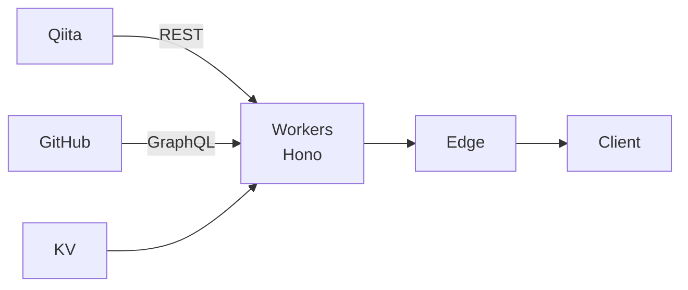

このメモは、Cloudflare Workers と Cloudflare Workers KV（KV）の実装についてまとめたものです。



ポイントが2つあります。

1つ目が KV をローカル環境で実装する方法についてです。

2つ目が KV の設定についてです。

Topic は以下のとおりです。

- KV[^1]

[^1]: https://www.cloudflare.com/ja-jp/developer-platform/workers-kv/

さらに詳しく見たい方は読み続けてください。

---

2023年10月1回目です。

1つ前のメモで Web App を作成しました。

その Web App のデータの取得の構成は、半分が Stateful でした。

ステータス（職務経験、保有資格）の保存先として、Cloudflare Workers KV に変更し、Stateless な状態にします。
- 記事の取得: 
   - Qiita API
- リポジトリの取得:
   - GitHub GraphQL API
- 職務経験の取得:
   - JSON &rarr; KV
- 保有資格の取得:
   - JSON &rarr; KV

https://github.com/danny-yamamoto/my-portfolio-hono-ts

https://my-portfolio-hono-ts.yamamoto-daisuke.workers.dev/

## Install Wrangler
- KV の作成、登録のため、`Wrangler` を install します。
- `Wrangler` は Cloudflare 開発者向け製品でビルドするためのコマンドライン ツールです。
:::details npm install -g wrangler
```bash
node ➜ /workspaces/my-portfolio-hono-ts (main) $ npm install -g wrangler
npm WARN deprecated rollup-plugin-inject@3.0.2: This package has been deprecated and is no longer maintained. Please use @rollup/plugin-inject.
npm WARN deprecated sourcemap-codec@1.4.8: Please use @jridgewell/sourcemap-codec instead

added 61 packages in 9s

6 packages are looking for funding
  run `npm fund` for details
node ➜ /workspaces/my-portfolio-hono-ts (main) $ wrangler --version
 ⛅️ wrangler 3.10.1
-------------------
```
:::
:::details wrangler login
```bash
node ➜ /workspaces/my-portfolio-hono-ts (main) $ wrangler login
 ⛅️ wrangler 3.10.1
-------------------
Attempting to login via OAuth...
Opening a link in your default browser: https://xxxxxxx
▲ [WARNING] Failed to open


Successfully logged in.
✔ Would you like to help improve Wrangler by sending usage metrics to Cloudflare? … no
Your choice has been saved in the following file: ../../home/node/.config/.wrangler/metrics.json.

  You can override the user level setting for a project in `wrangler.toml`:

   - to disable sending metrics for a project: `send_metrics = false`
   - to enable sending metrics for a project: `send_metrics = true`
node ➜ /workspaces/my-portfolio-hono-ts (main) $
```
:::

## Create namespace
::: details namespace
```bash
node ➜ /workspaces/my-portfolio-hono-ts (main) $ wrangler kv:namespace create CERTIFICATES
 ⛅️ wrangler 3.10.1
-------------------
▲ [WARNING] No configured name present, using `worker` as a prefix for the title


🌀 Creating namespace with title "worker-CERTIFICATES"
✨ Success!
Add the following to your configuration file in your kv_namespaces array:
{ binding = "CERTIFICATES", id = "aaaaaaaaaa" }
node ➜ /workspaces/my-portfolio-hono-ts (main) $ wrangler kv:namespace create CERTIFICATES --preview
 ⛅️ wrangler 3.10.1
-------------------
▲ [WARNING] No configured name present, using `worker` as a prefix for the title


🌀 Creating namespace with title "worker-CERTIFICATES_preview"
✨ Success!
Add the following to your configuration file in your kv_namespaces array:
{ binding = "CERTIFICATES", preview_id = "bbbbbbbbbb" }
node ➜ /workspaces/my-portfolio-hono-ts (main) $
```
:::

## KV Settings
- ここで注意です。
- ローカルで起動する場合は、ローカルの `kv` を参照しています。
- ローカルの `kv` とは、`.wrangler/state/v3` です。
- Cloudflare の console で登録した内容が表示されるわけではありません。ここで半日程度時間をロスしました。
- `kv_namespaces` の位置も重要です。`vars` の下に置くと、variables と認識されます。

:::details wrangler.toml
```toml
main = "src/index.tsx"
compatibility_date = "2023-09-28"

kv_namespaces = [
    { binding = "CERTIFICATES", id = "aaaaaaaaaa", preview_id = "bbbbbbbbbb" }
]

[vars]
GRAPHQL_API = "https://api.github.com/graphql"
GH_TOKEN = "ghp_ccccccccccccccccccccccccc"
```
:::

## Running Apps

:::details npm run dev
```bash
node ➜ /workspaces/my-portfolio-hono-ts (main) $ npm run dev

> dev
> run-p dev:*


> dev:esbuild
> esbuild --external:__STATIC_CONTENT_MANIFEST --bundle src/index.tsx --format=esm --watch --outfile=dist/_worker.js


> dev:wrangler
> wrangler dev src/index.tsx --live-reload

[watch] build finished, watching for changes...
 ⛅️ wrangler 3.10.1
-------------------
wrangler dev now uses local mode by default, powered by 🔥 Miniflare and 👷 workerd.
To run an edge preview session for your Worker, use wrangler dev --remote
Your worker has access to the following bindings:
- KV Namespaces:
  - CERTIFICATES: aaaaaaaaaa
- Vars:
  - GRAPHQL_API: "https://api.github.com/graphql"
  - GH_TOKEN: "ghp_ccccccccccccccccccccccccc"
⎔ Starting local server...
[mf:wrn] The latest compatibility date supported by the installed Cloudflare Workers Runtime is "2023-09-22",
but you've requested "2023-09-28". Falling back to "2023-09-22"...
[mf:inf] Ready on http://0.0.0.0:8787 
[mf:inf] - http://127.0.0.1:8787
[mf:inf] - http://172.17.0.2:8787
╭─────────────────────────────────────────────────────────────────────────────────────────────────────────────────────────────────────────────────────────────────────────────────────────────────────────────────────────────────────────────────────────────────────────────────────────────────────────────────────────────────────────╮
│ [b] open a browser, [d] open Devtools, [l] turn off local mode, [c] clear console, [x] to exit                                                                                                                                                                                                                                          │
╰─────────────────────────────────────────────────────────────────────────────────────────────────────────────────────────────────────────────────────────────────────────────────────────────────────────────────────────────────────────────────────────────────────────────────────────────────────────────────────────────────────────╯
```
:::

### Build and deployment
- Workers で動かします。
- KV の情報を登録します。
- Deploy Step
   1. Cloudflare に login
   1. 「Workers & Pages」をクリック
   1. 作成済みの Workers アプリケーションをクリック
   1. 「設定」tab をクリック
   1. 「変数」メニューをクリック
   1. 「KV 名前空間のバインディング」までスクロール
   1. 「変数を編集する」をクリック
   1. 変数名に「CERTIFICATES」、KV 命名空間に「worker-CERTIFICATES」
   1. 「保存してデプロイする」をクリック


## Summary
- KV について書きました。
- ググる場合は、1ヶ月内などなるべく直近の記事を参考にした方が良いと思います。Cloud / Edge 全般に言えることですが、機能追加や Update が多く、古い記事は賞味期限を迎えている場合が多いです。
- KV 以外にも、D1[^2] や Hyperdrive[^3] 、Workers AI[^4] など興味深い機能が目白押しです。継続して検証を続けたいと思います。

[^2]: https://developers.cloudflare.com/d1/
[^3]: https://www.cloudflare.com/ja-jp/developer-platform/products/hyperdrive/
[^4]: https://blog.cloudflare.com/workers-ai/

この投稿をみて何か得られた方は、いいね ❤️ をお願いします。

それでは、また別の話でお会いしましょう。👋
