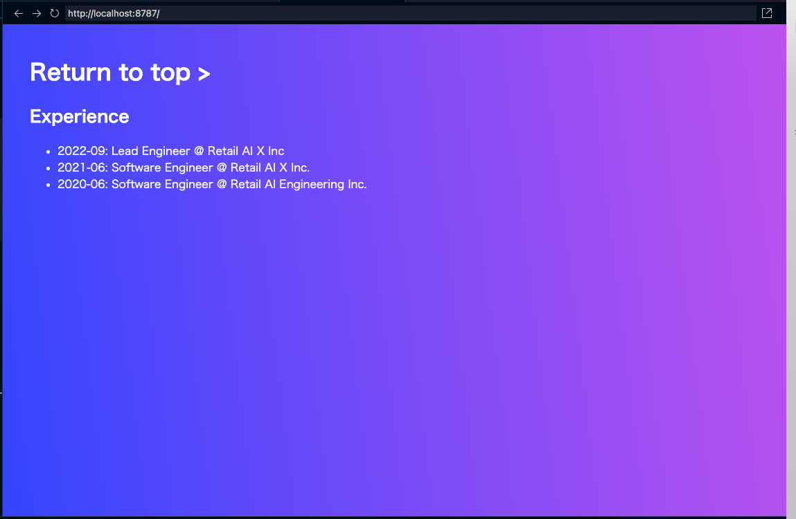
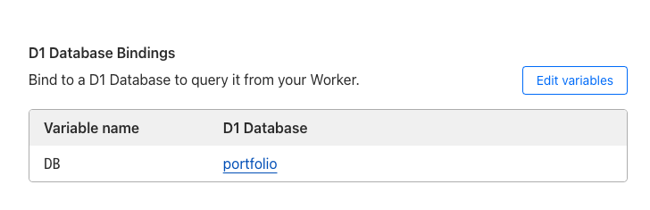
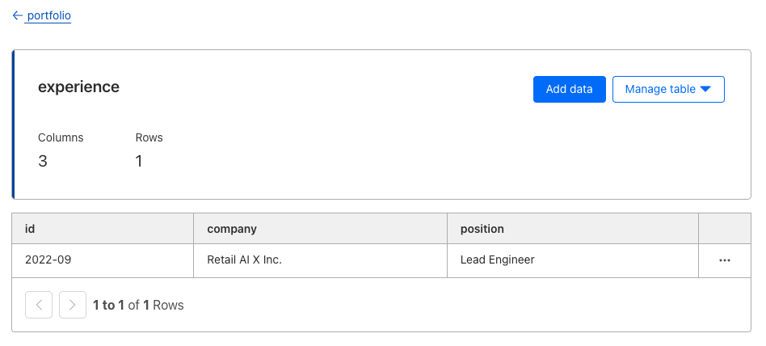

このメモは、`D1` についてのメモです。

`D1` は、2023年9月に open beta[^1] としてアナウンスされました。

[^1]: https://blog.cloudflare.com/d1-open-beta-is-here/?utm_campaign=developer-platform&utm_source=twitter&utm_medium=social&utm_content=bw23announcement

`D1` は、どのように役立つでしょうか?

SQLite を使用しているということから、Web App の Data Cache などが考えられます。
他には、CMS の構築も可能だと思います。

今回、Hono の　Web App で `D1` の実装を試します。

- Hono
- Workers
- Wrangler
- D1

---

2023年10月2回目です。

使用したリポジトリはこちらです。

https://github.com/danny-yamamoto/my-portfolio-hono-ts

https://my-portfolio-hono-ts.yamamoto-daisuke.workers.dev/

## D1 とは

> Cloudflare Workers用に設計されたデータベース[^2]

[^2]: https://blog.cloudflare.com/ja-jp/introducing-d1-ja-jp/

`D1` は Cloudflare のネイティブなサーバーレス データベースです。

Workers からの接続は、Cloudflare の画面で変数とデータベース名を紐づけるだけです。

## Installation

まず、ローカル開発環境を構築します。

公式の手順[^3] で問題なく install できます。

[^3]: https://developers.cloudflare.com/d1/get-started/

ローカルの root の `.wrangler` フォルダにデータが保存されます。`KV` と同じく。

- Using wrangler
```bash
wrangler login
export DATABASE_NAME="portfolio"
wrangler d1 create $DATABASE_NAME
```


```bash
touch ./schema.sql
```

```bash
wrangler d1 execute $DATABASE_NAME --local --file=./schema.sql
```

データが登録されたか確認します。
```bash
node ➜ /workspaces/my-portfolio-hono-ts (main) $ wrangler d1 execute $DATABASE_NAME --local --command='SELECT * FROM experience'
🌀 Mapping SQL input into an array of statements
🌀 Loading daefd626-cee4-44ab-bbde-65fe99759b95 from .wrangler/state/v3/d1
┌─────────┬────────────────────────────┬───────────────────┐
│ id      │ company                    │ position          │
├─────────┼────────────────────────────┼───────────────────┤
│ 2022-09 │ Retail AI X Inc            │ Lead Engineer     │
├─────────┼────────────────────────────┼───────────────────┤
│ 2021-06 │ Retail AI X Inc.           │ Software Engineer │
├─────────┼────────────────────────────┼───────────────────┤
│ 2020-06 │ Retail AI Engineering Inc. │ Software Engineer │
└─────────┴────────────────────────────┴───────────────────┘

node ➜ /workspaces/my-portfolio-hono-ts (main) $
```

上記の通り3件のレコードが登録されました。

## Connect from Workers to D1

上記で作成した database に Workers から接続するには、2つの設定が必要です。

- `wrangler.toml`

ローカル環境用の設定です。`wrangler d1 create $DATABASE_NAME` 実行時に表示される文字列を `wrangler.toml` に追加します。

```toml
[[d1_databases]]
binding = "DB" # i.e. available in your Worker on env.DB
database_name = "portfolio"
database_id = "xxxxxxxxxxxxxxxxxxxxx"
```

- Web Application
```typescript
export type Env = {
  GRAPHQL_API: string;
  GH_TOKEN: string;
  CERTIFICATES: KVNamespace;
  DB: D1Database; // here
};
```

```typescript
// Logic
const getExperience = async (env: Env) => {
  const { results } = await env.DB.prepare(
    "SELECT * FROM experience ORDER BY id DESC"
  )
  .all();
  return results
}
```

以下のコマンドを使用して、Web Application を起動してみます。

`database_id` が `Your worker has access to the following bindings:` の下に出力されます。
```bash
node ➜ /workspaces/my-portfolio-hono-ts (main) $ npm run dev

> dev
> run-p dev:*


> dev:esbuild
> esbuild --external:__STATIC_CONTENT_MANIFEST --bundle src/index.tsx --format=esm --watch --outfile=dist/_worker.js


> dev:wrangler
> wrangler dev src/index.tsx --live-reload

[watch] build finished, watching for changes...
 ⛅️ wrangler 3.10.1 (update available 3.11.0)
-------------------------------------------------------
wrangler dev now uses local mode by default, powered by 🔥 Miniflare and 👷 workerd.
To run an edge preview session for your Worker, use wrangler dev --remote
Your worker has access to the following bindings:
- KV Namespaces:
  - CERTIFICATES: aaaaaaaaaa
- D1 Databases:
  - DB: portfolio (xxxxxxxxxxxxxxxxxxxxx)
- Vars:
  - GRAPHQL_API: "https://api.github.com/graphql"
  - GH_TOKEN: "ghp_ccccccccccccccccccccccccc..."
⎔ Starting local server...
[mf:wrn] The latest compatibility date supported by the installed Cloudflare Workers Runtime is "2023-09-22",
but you've requested "2023-09-28". Falling back to "2023-09-22"...
[mf:inf] Ready on http://0.0.0.0:8787 
[mf:inf] - http://127.0.0.1:8787
[mf:inf] - http://172.17.0.2:8787
╭─────────────────────────────────────────────────────────────────────────────────────────────────────────────────────────────────────────────────────────────────────────────────────╮
│ [b] open a browser, [d] open Devtools, [l] turn off local mode, [c] clear console, [x] to exit                                                                                      │
╰─────────────────────────────────────────────────────────────────────────────────────────────────────────────────────────────────────────────────────────────────────────────────────╯
```

「http://127.0.0.1:8787」にアクセスして、どのようになるかを見てみます。



上記の通り、データが表示されました。成功です。

## Deployment

Workers で動かします。

- Deploy Step
   1. Cloudflare に login
   1. 「Workers & Pages」をクリック
   1. 作成済みの Workers アプリケーションをクリック
   1. 「設定」tab をクリック
   1. 「変数」メニューをクリック
   1. 「D1 Database Bindings」までスクロール
   1. 「変数を編集する」をクリック
   1. 「保存してデプロイする」をクリック



`D1` にデータを登録します。



build します。

```bash
node ➜ /workspaces/my-portfolio-hono-ts (main) $ npm run build

> build
> esbuild --external:__STATIC_CONTENT_MANIFEST --bundle src/index.tsx --format=esm --outfile=dist/_worker.js


  dist/_worker.js  60.1kb

⚡ Done in 38ms
node ➜ /workspaces/my-portfolio-hono-ts (main) $
```

Workers を更新して、どのようになるかを見てみます。


上記の通り、データが表示されました。成功です。

## Conclusion
この投稿では、`D1` がどのようなユースケースに利用できるか、また、サービスをエミュレートする際の D1 と Wrangler の機能について説明しました。

この投稿をみて何か得られた方は、いいね ❤️ をお願いします。

それでは、また別の話でお会いしましょう。👋
